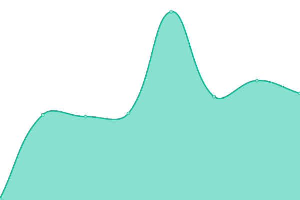

# [📈 Live Status](https://stats.dolciss.net): <!--live status--> **🟩 All systems operational**

This repository contains the open-source uptime monitor and status page for [L-tan](http://dolciss.net/), powered by [Upptime](https://github.com/upptime/upptime).

With [Upptime](https://upptime.js.org), you can get your own unlimited and free uptime monitor and status page, powered entirely by a GitHub repository. We use [Issues](https://github.com/dolciss/upptime/issues) as incident reports, [Actions](https://github.com/dolciss/upptime/actions) as uptime monitors, and [Pages](https://stats.dolciss.net) for the status page.

<!--start: status pages-->
<!-- This summary is generated by Upptime (https://github.com/upptime/upptime) -->
<!-- Do not edit this manually, your changes will be overwritten -->
<!-- prettier-ignore -->
| URL | Status | History | Response Time | Uptime |
| --- | ------ | ------- | ------------- | ------ |
|  [root](https://dolciss.net/) | 🟩 Up | [root.yml](https://github.com/dolciss/upptime/commits/HEAD/history/root.yml) | 

 131ms
     
 | 

<a href="https://stats.dolciss.net/history/root">100.00%</a>
    

|  [Feed](https://bsky-feed.dolciss.net/.well-known/did.json) | 🟩 Up | [feed.yml](https://github.com/dolciss/upptime/commits/HEAD/history/feed.yml) | 

 494ms
     
 | 

<a href="https://stats.dolciss.net/history/feed">100.00%</a>
    

|  [PDS](https://pds.dolciss.net/xrpc/_health) | 🟩 Up | [pds.yml](https://github.com/dolciss/upptime/commits/HEAD/history/pds.yml) | 

 592ms
     
 | 

<a href="https://stats.dolciss.net/history/pds">100.00%</a>
    

<!--end: status pages-->

[**Visit our status website →**](https://stats.dolciss.net)

## 📄 License

- Powered by: [Upptime](https://github.com/upptime/upptime)
- Code: [MIT](./LICENSE) © [L-tan](http://dolciss.net/)
- Data in the `./history` directory: [Open Database License](https://opendatacommons.org/licenses/odbl/1-0/)
